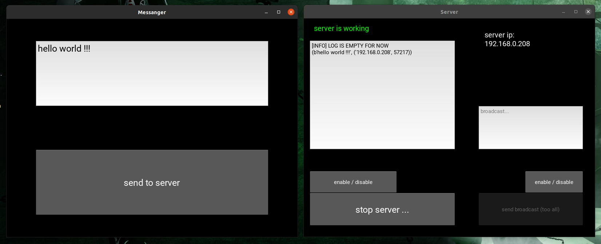

# SOCKETS SERVER



## 🤨 Навіщо ?:
це основа для написання "клієнт-сервер" систем.

## 🤓 Опис:
це сервер із GUI який працює на SOCKETS і отримує сповіщення від ВСИХ клієнтів які підключені. також тут є приклад простого клієнта кий відправляє дані на сервер.

## ☠️ Використані технології:
- все написано на PYTHON
- GUI на KIVY
- під капотом працює на SOCKETS

## 🌱 Структура проекта:
- `screenshots/` — непотрібна для роботи папка, тут лежать скріншоти програми
- `server/` - папка із ісходним кодом для сервера
- `client/` — папка із ісходним кодом для кліаєнта

## ⚠️ ПОПЕРЕДЖЕННЯ:
- сервер працює ЛИШЕ на LINUX машинах !
- клієнт працює на різних платформах

## 😎 Як це запустити ?:
1. встановлюємо необхідні пакети
```bash
sudo apt update
sudo apt install python3
sudo apt install python3-pip python3-dev libsdl2-dev libsdl2-image-dev libsdl2-mixer-dev libsdl2-ttf-dev libportmidi-dev libswscale-dev libavformat-dev libavcodec-dev zlib1g-dev libgstreamer1.0-0 gstreamer1.0-plugins-base gstreamer1.0-plugins-good
pip install "kivy[base]"
pip install adafruit-ampy
```
2. в файлі `client/config.py` записуємо IP адресу сервера ось в цьому рядку
```python
server_ip = 'ВАШ_АЙПІ_СЕРВЕРА'
```
3. запускаємо сервер і клієнта командами
```bash
python3 main.py
```

